# ROOTインストール

ROOTのインストール方法。

- Windowsの人
  - Windows上に直接インストールします。
  - WSLにインストールすることもできます。

## Windows (直接)

共有されているBoxのリンクから、"ROOT-6-win"フォルダの中身を全てダウンロードする。以下、それらをインストールする。

### CMake

"cmake-3.30.2-windows-x86_64.msi"をダブルクリックして、指示に従う。デフォルトの設定のままでOK。

"Add CMake to the PATH environment variable"にチェックが入っていることを確認する。

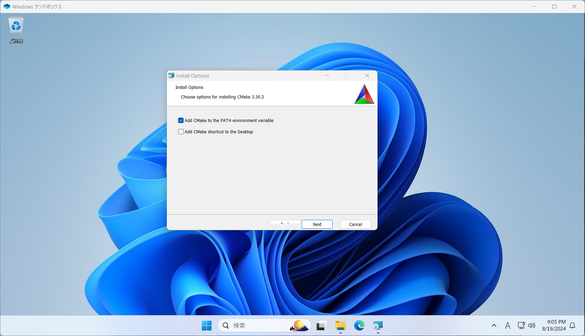

### Visual Studio 2022

※VSCodeエディタのことではない。C++の開発環境の方のこと。

1. "VisualStudioSetup.exe"をダブルクリックして、指示に従う。

2. Visual Stuio Installerがインストールされると、以下の画面が表示される。

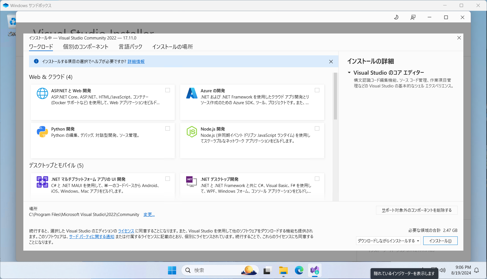

3. スクロールして、「C++によるデスクトップ開発」だけにチェックを入れる。

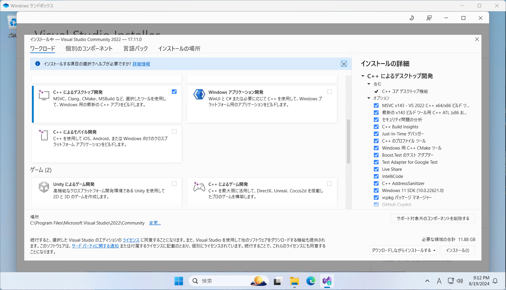

4. 右下「インストール」をクリックするとインストールが始まる（PCの性能次第で少し待つ）。

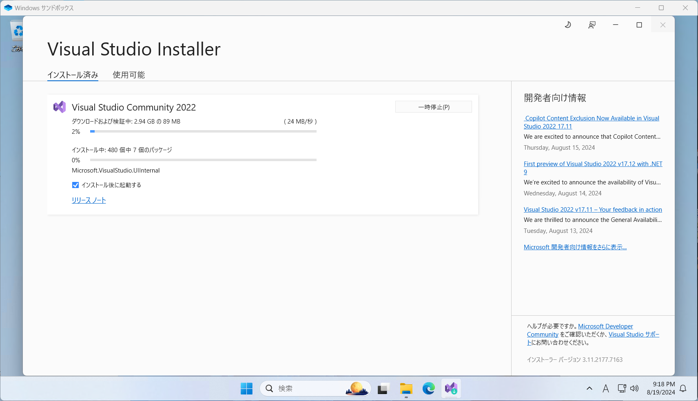

5. インストールが完了するとサインインを要求する画面が現れるが、今回はVisual Studioのデスクトップ環境は使わないので、「今はスキップする」をクリック。

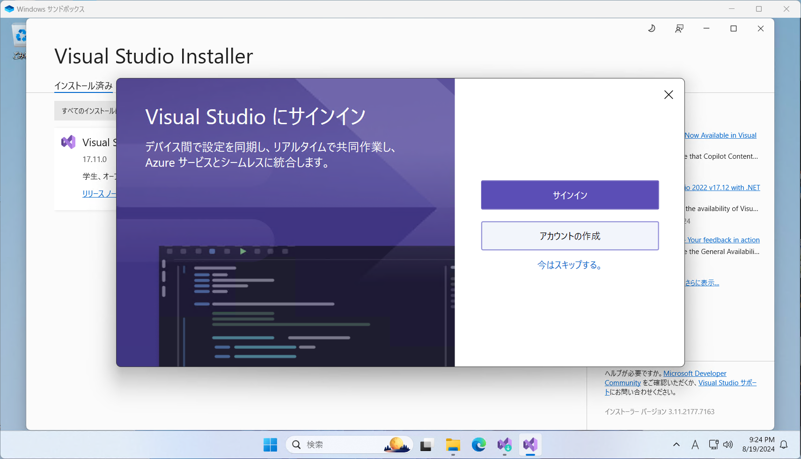

6. 以下の画面が出たら「Visual Studioの開始」をクリック。

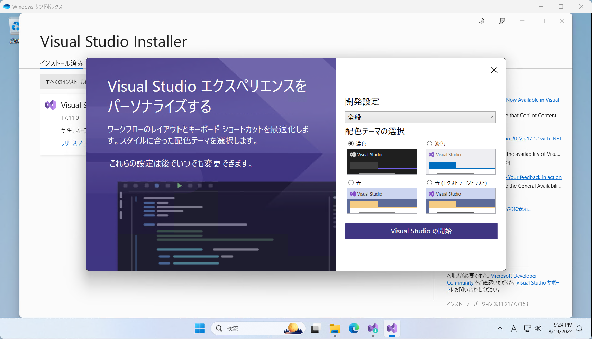

7. 「Visual Studio 2022」が起動すれば完了。

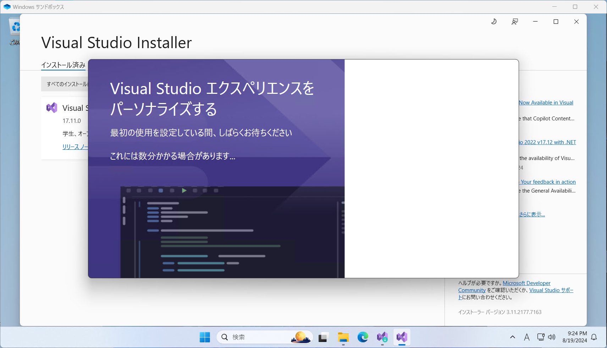

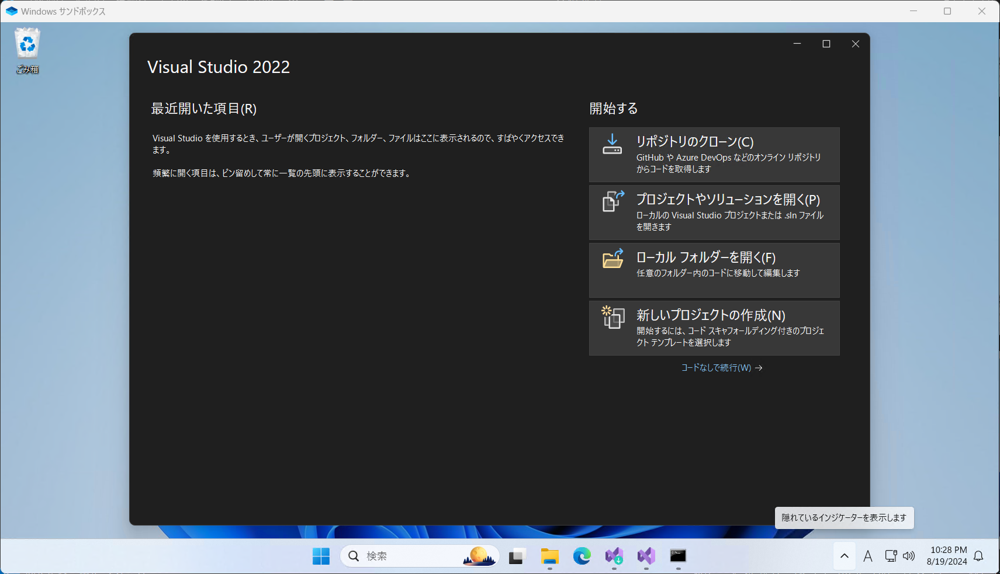

### ROOT

1. "root_v6.32.02.win64.vc17.exe"をダブルクリックしてインストール。以下の画面が出たら "Add ROOT to the system PATH for all users"を選択して「次へ」。"Create ROOT Desktop Icon"は自由。

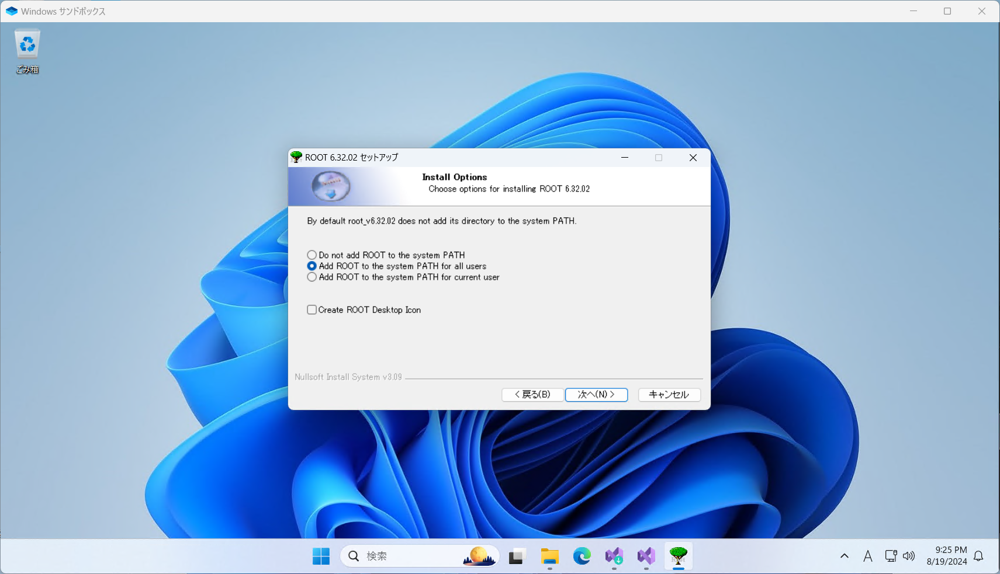

2. インストール先のフォルダはデフォルトでよい。

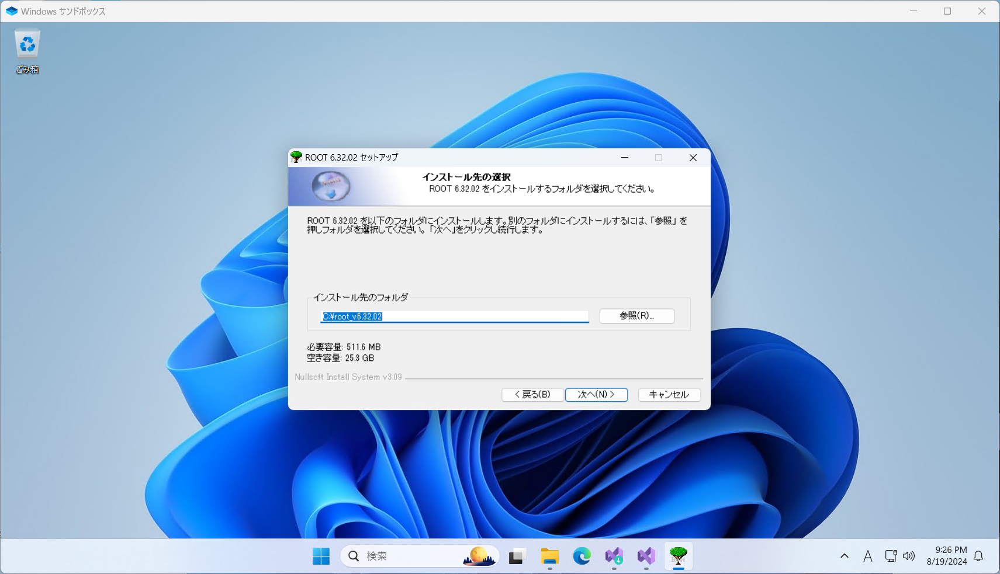

3. 構成要素もデフォルトのままでよい。「インストール」をクリック。

4. 以下の画面が出たらインストール完了。

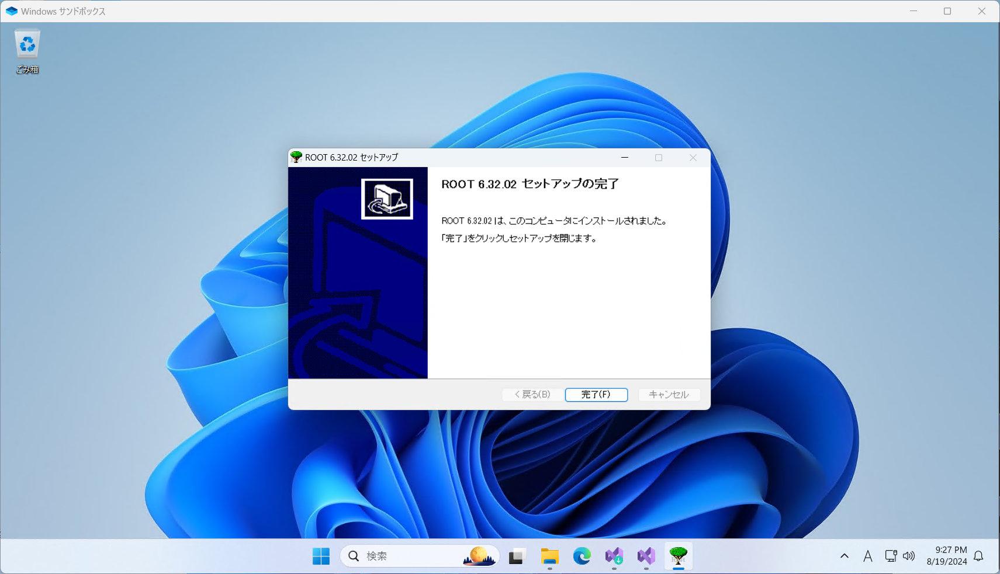

### ROOTの起動方法

スタートメニューから、「Visual Studio 2022」フォルダ→「x86 Native Tools Command Prompt for VS 2019」をクリックすると、Visual Studio環境のコマンドプロンプトが起動する。

はじめに以下を毎回実行する。

`C:\root_v6.32.02\bin\thisroot.bat`

自分の作業ディレクトリに移動して`root`と入力するとROOTが起動する。

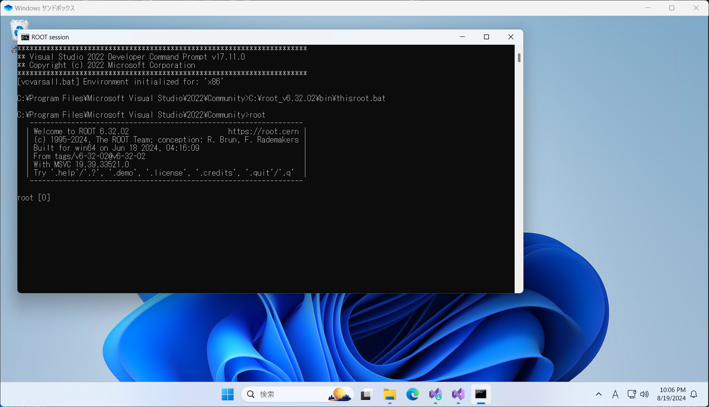

#### PowerShellを使いたい人へ

「Visual Studio 2022」フォルダ内のPowerShellからでも同様のことができるが、そのときは`thisroot.bat`の代わりに`thisroot.ps1`を実行する必要がある。

が、`thisroot.ps1`を実行するにはプログラムの実行ポリシーを緩める必要がある模様（既知 : https://root-forum.cern.ch/t/issues-with-root-installation-in-windows/56404/10 ）。よってコマンドプロンプトの利用を推奨

### 参考

- ROOT講習会
  - https://github.com/ymapteam/root_lecture/blob/main/install/windows_binary.md

- CERN公式
  - https://root.cern/install/#download-a-pre-compiled-binary-distribution

## Windows (WSL)

### WSL (Ubuntu) をインストールする

どこのサイトに載っている方法でも大丈夫（WSL2の情報なら）。

以下が詳しい。

https://github.com/ymapteam/root_lecture/blob/main/install/windows_wsl.md

### WSLにROOTをインストールする

Linux (Ubuntu) と同じ。

## Linux (Ubuntu)

方法は2つ。

- ビルド済みバイナリをインストール

  - 簡単。速い。

- 自分でビルドする。

  - とても時間がかかる。かつ、途中でメモリ不足で失敗することがあるので、サマチャレ期間中はやる必要はない。高エネルギー系に進むなら1回やっておくと役にたつかも？？

  - 自分でオプションをカスタマイズしたいときはこちら。

  - ※他のOSでも自分でビルドすることはできる。

以下で簡単に紹介。

## ビルド済みバイナリをインストール

以下を読む。

https://root.cern/install/#download-a-pre-compiled-binary-distribution

https://github.com/ymapteam/root_lecture/blob/main/install/windows_wsl_binary.md

特に、依存関係を全てインストールするのを忘れないように。

https://root.cern/install/dependencies/

## 自分でビルドする

以下を読む。

https://root.cern/install/#build-from-source

https://github.com/ymapteam/root_lecture/blob/main/install/windows_wsl_build.md

この場合でももちろん依存関係のインストールは事前にやっておく。

https://root.cern/install/dependencies/

ビルドは環境により時間がかかる。メモリ不足で中断してしまったときは、オプションで並列数を変更して、もう一度実行するとよい。

## Mac

ROOTのサイトからのダウンロードの他に、`brew`を使えるらしい。

https://root.cern/install/#macos-package-managers